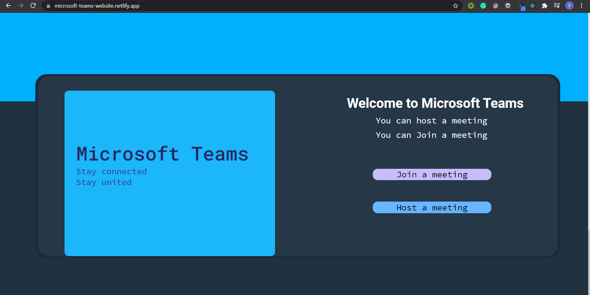
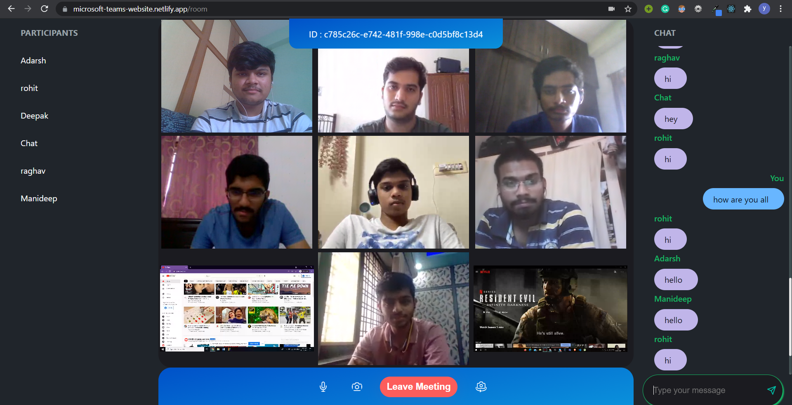

# Microsoft-Teams
Microsoft Teams clone is the challenge given to us in the microsoft engage 2021.

## Deployed web app link

#### Click to open web app : [Microsoft Teams](https://microsoft-teams-website.netlify.app/)

## Demo video

#### Click to watch : [Demo](https://youtu.be/VuJrJyytTcI)

## Screenshots

## Features

- Multi people video call feature
- Video on/off feature
- Audio on/off feature
- Screen sharing feature
- Chat feature during meeting
- Participant list

## Backend

- #### Server used : [Express JS](https://expressjs.com/)

## Frontend

- #### Frontend Library : [React JS](https://reactjs.org/)
- #### State management : [Redux](https://redux.js.org/)

### Note
For a smooth experience, use this website only in laptops or in pc. It is not responsive for other devices.
